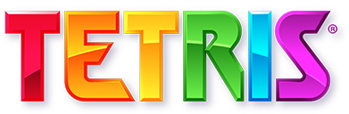

# Tetris Game

A modern, responsive Tetris game built with Next.js, React, and Tailwind CSS featuring smooth animations and clean UI.



**Live Demo:** [https://tetris-game.bjornleonhenry.com](https://tetris-game.bjornleonhenry.com)

## About

An interactive Tetris game implementation featuring classic gameplay mechanics with modern web technologies. Built using Next.js 14, React hooks for state management, Framer Motion for smooth animations, and Tailwind CSS for responsive styling.

## Features

- Classic Tetris gameplay mechanics
- Responsive design that works on desktop and mobile
- Smooth animations powered by Framer Motion
- Clean, modern UI with Tailwind CSS
- Score tracking and level progression
- Pause/resume functionality
- Sound controls

## Technologies Used

- **Next.js 15** - React framework for production
- **React 19** - User interface library
- **TypeScript** - Type-safe JavaScript
- **Tailwind CSS** - Utility-first CSS framework
- **Framer Motion** - Animation library
- **Radix UI** - Accessible component primitives
- **Lucide React** - Icon library

## Getting Started

### Prerequisites

- Node.js 18+
- pnpm (recommended) or npm

### Installation

1. Clone the repository:

```bash
git clone https://github.com/bjornleonhenry/tetris-game.git
cd tetris-game
```

1. Install dependencies:

```bash
pnpm install
```

1. Run the development server:

```bash
pnpm dev
```

1. Open [http://localhost:3000](http://localhost:3000) in your browser.

### Build for Production

```bash
pnpm build
pnpm start
```

## How to Play

- **Left/Right Arrow Keys** - Move piece horizontally
- **Down Arrow Key** - Soft drop (faster fall)
- **Up Arrow Key** - Rotate piece
- **Spacebar** - Hard drop (instant fall)
- **P** - Pause/Resume game

## Project Structure

```text
├── app/                    # Next.js app directory
├── components/            # Reusable UI components
│   └── ui/               # Radix UI components
├── hooks/                # Custom React hooks
├── lib/                  # Utility functions
├── public/               # Static assets
├── styles/               # Global styles
└── tetris.tsx            # Main game component
```

## Development

The game logic is contained primarily in `tetris.tsx`, which handles:

- Game state management
- Tetromino generation and movement
- Line clearing logic
- Score calculation
- Collision detection

## Contributing

Contributions are welcome! Please feel free to submit a Pull Request.

## License

This project is open source and available under the [MIT License](LICENSE).

## Author

Bjorn Leon Henry

- GitHub: [@bjornleonhenry](https://github.com/bjornleonhenry)
- Website: [bjornleonhenry.com](https://bjornleonhenry.com)

---

Built with Next.js and deployed on Vercel.